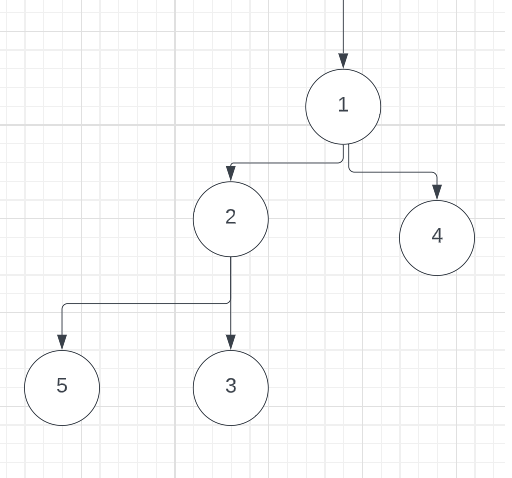
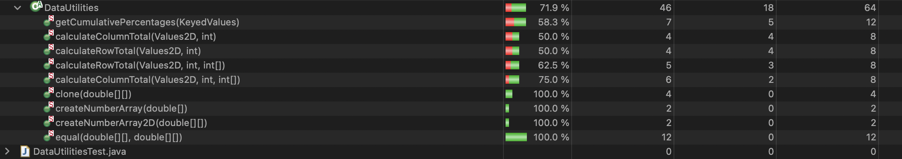
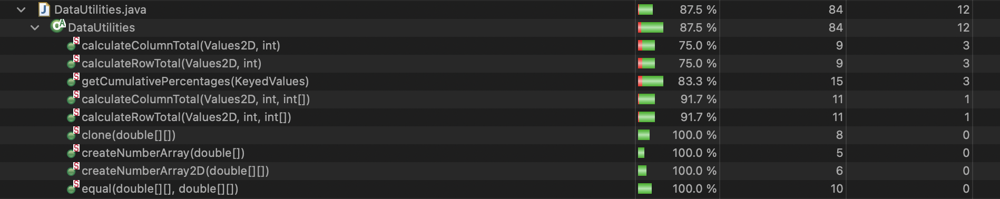
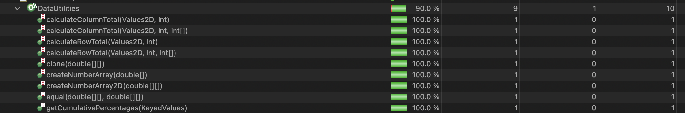
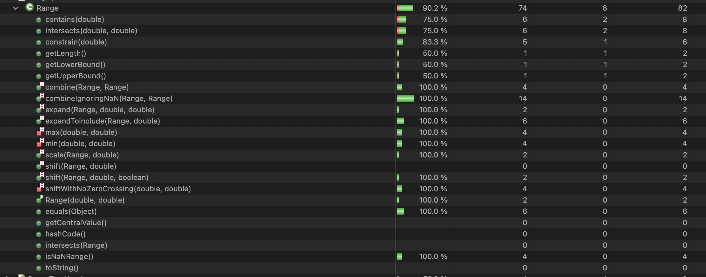
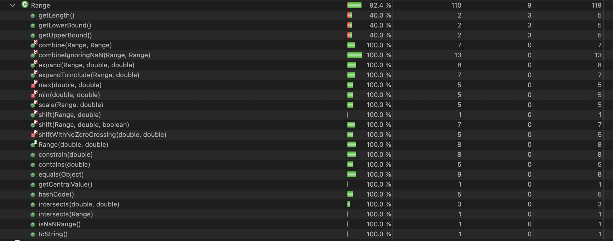
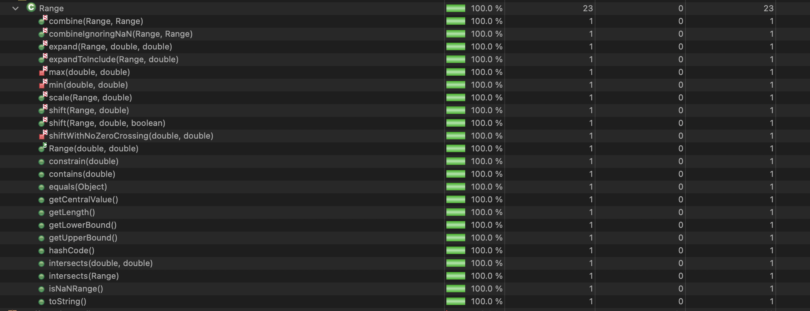

**SENG 438 - Software Testing, Reliability, and Quality**

**Lab. Report #3 – Code Coverage, Adequacy Criteria and Test Case Correlation**

| Group 3:      |     |
| -------------- | --- |
| Student Names: |   Aaron Frerichs  |
|                |   Jesse Gerbrandt  |
|                |   Avijot Girn  |
|                |   Ethan Subasic  |

(Note that some labs require individual reports while others require one report
for each group. Please see each lab document for details.)

# 1 Introduction

In this lab, whitebox testing was conducted on the same JFreeChart program as the previous assignment. With access to the source code, coverage tools, path coverage, and DU calculations were possible to better justify the quality of the tests. The focus of these tests was once again the the Range and Data Utilities objects within the program. 

# 2 Manual data-flow coverage calculations for X and Y methods

Contains (Range Test Method):

CFG:

Def-Use Pairs:

Definitions: 
-value

Uses:
-value<this.lower

-value>this.upper

-value>=this.lower

-value<=this.upper

Def-Use Sets:

[value<this.lower]

[value<this.lower, value>this.upper]

[value<this.lower, value>this.upper, value>=this.lower, value<=this.upper]

Test Cases:

    1. containsValueShouldBeTrue
    Definitions: value
    Uses: value<this.lower, value>this.upper, value>=this.lower, value<=this.upper
    
    2. containsValueOver
    Definitions: value
    Uses: value<this.lower, value>this.upper

    3. containsValueUnder
    Definitions: value
    Uses: value<this.lower

    4. containsValueUpperEdge
    Definitions: value
    Uses: value < this.lower, value > this.upper, value > = this.lower, value < = this.upper

    5. containsValueLowerEdge
    Definitions: value
    Uses: value<this.lower, value>this.upper, value>=this.lower, value<=this.upper

    6. containsNegValue
    Definitions: value
    Uses: value<this.lower

    7. containtsOnNegRange
    Definitions: value
    Uses: value<this.lower, value>this.upper, value>=this.lower, value<=this.upper

    DU Pair Coverage:

    100%: All sets of DU Pairs have been tested

    calculateColumnTotal (Data Utilities Test Method):

CFG:

Def-Use Pairs:

Definitions:

    Values2D data
    Uses:
    -ParamChecks.nullNotPermitted(data, "data");
    -rowCount = data.getRowCount();
    -n = data.getValue(r, column);
    -n = data.getValue(r2, column);

    int column
    Uses: 
    -n = data.getValue(r, column);
    -n = data.getValue(r2, column);

    double total

    int rowCount
    Uses:
    r<rowCount
    r2 > rowCount

    
    int r
    Uses:
    r < rowCount
    n = data.getValue(r, column);

    Number n
    Uses:
    n != null
    total += n.doubleValue();

    int r2
    Uses:
    r2 > rowCount
    n = data.getValue(r2, column);

Def-Use Sets:

data:

    [ParamChecks.nullNotPermitted(data, "data")]

    [ParamChecks.nullNotPermitted(data, "data"), rowCount = data.getRowCount();]

    [ParamChecks.nullNotPermitted(data, "data"), rowCount = data.getRowCount();, n = data.getValue(r, column);]

    [ParamChecks.nullNotPermitted(data, "data"), rowCount = data.getRowCount();, n = data.getValue(r2, column);]
    

column:

    []

    [n = data.getValue(r, column);]

    [n = data.getValue(r2, column);]

total:

    []

    [total += n.doubleValue();]

rowCount:

    []

    [r < rowCount, r2 > rowCount]

r:

    []

    [r < rowCount]

    [r < rowCount, n = data.getValue(r, column);]

n:

    []

    [n!=null]

    [n!=null, total += n.doubleValue();]

r2:

    []

    [r2 > rowCount]

    [r2 > rowCount, n = data.getValue(r2, column);]

Test Cases:

    1. calculateColumnTotalForTwoValues
    Definitions:
    data
        Uses:
        rowCount = data.getRowCount();
        Number n = data.getValue(r, column);

    column
        Uses:
        Number n = data.getValue(r, column);
    
    rowCount
        Uses:
        r < rowCount
        r2 > rowCount

    r
        Uses:
        r < rowCount
        n = data.getValue(r, column);

    n
        Uses:
        n != null
        total += n.doubleValue();

    r2:
        Uses:
        r2 > rowCount
    
    2. calculateColumnTotalForThreeValuesAndTwoRows
    Definitions:
    data
        Uses:
        rowCount = data.getRowCount();
        Number n = data.getValue(r, column);

    column
        Uses:
        Number n = data.getValue(r, column);
    
    rowCount
        Uses:
        r < rowCount
        r2 > rowCount

    r
        Uses:
        r < rowCount
        n = data.getValue(r, column);

    n
        Uses:
        n != null
        total += n.doubleValue();

    r2:
        Uses:
        r2 > rowCount

    3. tryToUseNegativeIndexForTheColumn
    Definitions:
    data
        Uses:
        rowCount = data.getRowCount();
        Number n = data.getValue(r, column);

    column
        Uses:
        Number n = data.getValue(r, column);
    
    rowCount
        Uses:
        r < rowCount
        r2 > rowCount

    r
        Uses:
        r < rowCount
        n = data.getValue(r, column);

    n
        Uses:
        n != null

    r2:
        Uses:
        r2 > rowCount

    4. tryToUseLargerThanPossibleIndexForTheColumn
    Definitions:
    data
        Uses:
        rowCount = data.getRowCount();
        Number n = data.getValue(r, column);

    column
        Uses:
        Number n = data.getValue(r, column);
    
    rowCount
        Uses:
        r < rowCount
        r2 > rowCount

    r
        Uses:
        r < rowCount
        n = data.getValue(r, column);

    n
        Uses:
        n != null

    r2:
        Uses:
        r2 > rowCount

DU Pair Coverage:

    Covered Sets: 11
    Total Sets: 20
    Coverage: 55%

# 3 A detailed description of the testing strategy for the new unit test

The new unit tests were developed with the requirements of reaching 60% condition coverage, 70% branch coverage, and 90% statement coverage. Using results from DU analysis and generation of CDFs in order to further our understanding of the functions tested, these requirements were able to be met. We strived for this coverage throughout the entirety of the object files that we tested upon. 

# 4 A high level description of five selected test cases you have designed using coverage information, and how they have increased code coverage

Text…

# 5 A detailed report of the coverage achieved of each class and method (a screen shot from the code cover results in green and red color would suffice)
Branch Coverage for DataUtilities:

Line Coverage for DataUtilities:

Method Coverage for DataUtilites:

Branch Coverage for Range:

Line Coverage for Range:

Method Coverage for Range:

# 6 Pros and Cons of coverage tools used and Metrics you report

# 7 A comparison on the advantages and disadvantages of requirements-based test generation and coverage-based test generation.

Requirements-Based Test Generation:

Pros:

Cons:

Coverage-Based Test Generation:

Pros:

Cons:

# 8 A discussion on how the team work/effort was divided and managed

The effort for this project was divided evenly across all 4 members of the group. Work was divided evenly, with Jesse focusing on section 3.1, Avi and Aaron focusing on section 3.2, and Ethan focusing on section 3.3. Team members that were tasked with easier parts of the assignment helped out with more challenging parts, with the entire team coming together to develop tests for section 3.3.

# 9 Any difficulties encountered, challenges overcome, and lessons learned from performing the lab

Text…

# 10 Comments/feedback on the lab itself

Text…
