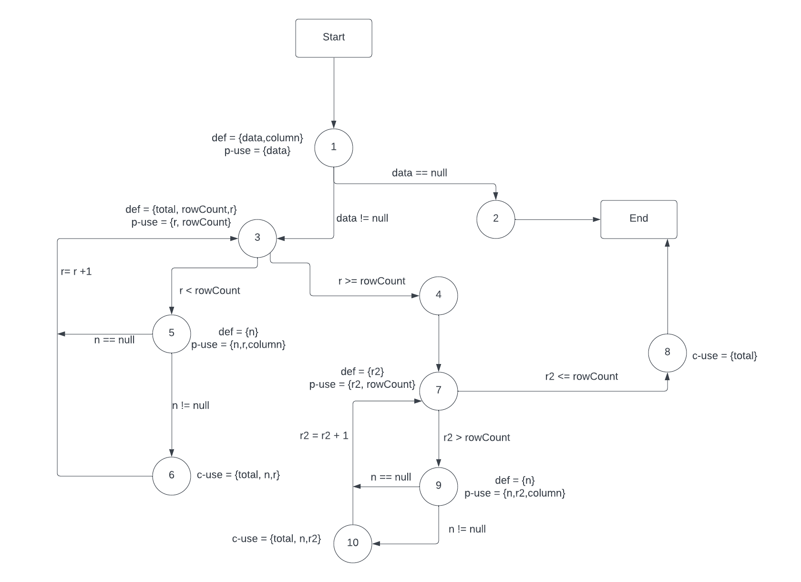

**SENG 438 - Software Testing, Reliability, and Quality**

**Lab. Report #3 – Code Coverage, Adequacy Criteria and Test Case Correlation**

| Group 3:      |     |
| -------------- | --- |
| Student Names: |   Aaron Frerichs  |
|                |   Jesse Gerbrandt  |
|                |   Avijot Girn  |
|                |   Ethan Subasic  |

(Note that some labs require individual reports while others require one report
for each group. Please see each lab document for details.)

# 1 Introduction

In this lab, whitebox testing was conducted on the same JFreeChart program as the previous assignment. With access to the source code, coverage tools, path coverage, and DU calculations were possible to better justify the quality of the tests. The focus of these tests was once again the the Range and Data Utilities objects within the program. 

# 2 Manual data-flow coverage calculations for X and Y methods

Contains (Range Test Method):

CFG:


Def-Use Pairs:

Definitions: 
-value

Uses:
-value<this.lower

-value>this.upper

-value>=this.lower

-value<=this.upper


Def-Use Sets:

[value<this.lower]

[value<this.lower, value>this.upper]

[value<this.lower, value>this.upper, value>=this.lower, value<=this.upper]

Test Cases:


    1. containsValueShouldBeTrue
    Definitions: value
    Uses: value<this.lower, value>this.upper, value>=this.lower, value<=this.upper
    
    2. containsValueOver
    Definitions: value
    Uses: value<this.lower, value>this.upper

    3. containsValueUnder
    Definitions: value
    Uses: value<this.lower

    4. containsValueUpperEdge
    Definitions: value
    Uses: value < this.lower, value > this.upper, value > = this.lower, value < = this.upper

    5. containsValueLowerEdge
    Definitions: value
    Uses: value<this.lower, value>this.upper, value>=this.lower, value<=this.upper

    6. containsNegValue
    Definitions: value
    Uses: value<this.lower

    7. containtsOnNegRange
    Definitions: value
    Uses: value<this.lower, value>this.upper, value>=this.lower, value<=this.upper

    DU Pair Coverage:

    100%: All sets of DU Pairs have been tested


    calculateColumnTotal (Data Utilities Test Method):

CFG:



Def-Use Pairs:

Definitions:

    Values2D data
    Uses:
    -ParamChecks.nullNotPermitted(data, "data");
    -rowCount = data.getRowCount();
    -n = data.getValue(r, column);
    -n = data.getValue(r2, column);


    int column
    Uses: 
    -n = data.getValue(r, column);
    -n = data.getValue(r2, column);


    double total


    int rowCount
    Uses:
    r<rowCount
    r2 > rowCount

    
    int r
    Uses:
    r < rowCount
    n = data.getValue(r, column);


    Number n
    Uses:
    n != null
    total += n.doubleValue();

    int r2
    Uses:
    r2 > rowCount
    n = data.getValue(r2, column);


Def-Use Sets:

data:

    [ParamChecks.nullNotPermitted(data, "data")]

    [ParamChecks.nullNotPermitted(data, "data"), rowCount = data.getRowCount();]

    [ParamChecks.nullNotPermitted(data, "data"), rowCount = data.getRowCount();, n = data.getValue(r, column);]

    [ParamChecks.nullNotPermitted(data, "data"), rowCount = data.getRowCount();, n = data.getValue(r2, column);]
    

column:

    []

    [n = data.getValue(r, column);]

    [n = data.getValue(r2, column);]

total:

    []

    [total += n.doubleValue();]

rowCount:

    []

    [r < rowCount, r2 > rowCount]

r:

    []

    [r < rowCount]

    [r < rowCount, n = data.getValue(r, column);]

n:

    []

    [n!=null]

    [n!=null, total += n.doubleValue();]

r2:

    []

    [r2 > rowCount]

    [r2 > rowCount, n = data.getValue(r2, column);]


Test Cases:

    1. calculateColumnTotalForTwoValues
    Definitions:
    data
        Uses:
        rowCount = data.getRowCount();
        Number n = data.getValue(r, column);

    column
        Uses:
        Number n = data.getValue(r, column);
    
    rowCount
        Uses:
        r < rowCount
        r2 > rowCount

    r
        Uses:
        r < rowCount
        n = data.getValue(r, column);

    n
        Uses:
        n != null
        total += n.doubleValue();

    r2:
        Uses:
        r2 > rowCount
    
    2. calculateColumnTotalForThreeValuesAndTwoRows
    Definitions:
    data
        Uses:
        rowCount = data.getRowCount();
        Number n = data.getValue(r, column);

    column
        Uses:
        Number n = data.getValue(r, column);
    
    rowCount
        Uses:
        r < rowCount
        r2 > rowCount

    r
        Uses:
        r < rowCount
        n = data.getValue(r, column);

    n
        Uses:
        n != null
        total += n.doubleValue();

    r2:
        Uses:
        r2 > rowCount

    3. tryToUseNegativeIndexForTheColumn
    Definitions:
    data
        Uses:
        rowCount = data.getRowCount();
        Number n = data.getValue(r, column);

    column
        Uses:
        Number n = data.getValue(r, column);
    
    rowCount
        Uses:
        r < rowCount
        r2 > rowCount

    r
        Uses:
        r < rowCount
        n = data.getValue(r, column);

    n
        Uses:
        n != null

    r2:
        Uses:
        r2 > rowCount

    4. tryToUseLargerThanPossibleIndexForTheColumn
    Definitions:
    data
        Uses:
        rowCount = data.getRowCount();
        Number n = data.getValue(r, column);

    column
        Uses:
        Number n = data.getValue(r, column);
    
    rowCount
        Uses:
        r < rowCount
        r2 > rowCount

    r
        Uses:
        r < rowCount
        n = data.getValue(r, column);

    n
        Uses:
        n != null

    r2:
        Uses:
        r2 > rowCount

DU Pair Coverage:

    Covered Sets: 11
    Total Sets: 20
    Coverage: 55%


# 3 A detailed description of the testing strategy for the new unit test

The new unit tests were developed with the requirements of reaching 60% condition coverage, 70% branch coverage, and 90% statement coverage. Using results from DU analysis and generation of CDFs in order to further our understanding of the functions tested, these requirements were able to be met. We strived for this coverage throughout the entirety of the object files that we tested upon. 

# 4 A high level description of five selected test cases you have designed using coverage information, and how they have increased code coverage

**DataUtilities.java**  
*```equalsTestFirstNull()```*  
    The purpose of this test was to cover the ```equals()``` method in the DataUtilities class. This method was an important part of increasing our coverage as it affected branch and conditional coverage.


**DataUtilities.java**
*equalsTestSecondNull()*


# 5 A detailed report of the coverage achieved of each class and method (a screen shot from the code cover results in green and red color would suffice)
Branch Coverage for DataUtilities:


Line Coverage for DataUtilities:


Method Coverage for DataUtilites:


Branch Coverage for Range:


Line Coverage for Range:


Method Coverage for Range:


# 6 Pros and Cons of coverage tools used and Metrics you report

The coverage tools we tried using were EclEmma and CodeCoverage. We tried EclEmma first and it had most of the functionality we needed provided we had to switch out condition coverage with method coverage. We then tried to use code coverage to see if it provided any additional functionality but it broke all the tests right off the bat so just decided to keep going with EclEmma.

Pros:

-Comes installed with eclipse and is simple to use
-Provides many different coverage options to monitor.
-Good UI to see what has been covered fully, partially, and not at all 

Cons: 

-Mocking does work with it so we had to just use the dependant interfaces
-Didnt have the exact coverage options that is recommended so we had to use similar alternatives
-It would count the abstract class declaration as a line so it would hurt the coverage of the overall file

# 7 A comparison on the advantages and disadvantages of requirements-based test generation and coverage-based test generation.

Requirements-Based Test Generation:

Pros:
    Testing of specific requirements to ensure functions work as intended.
    Privacy of code.
    No need for testers to dissect and understand source code.

Cons:
    Requirements may not fully reflect functionality
    Testers cannot diagnose cause of problem, only that a problem exists.
    Coverage of testing is unknown.

Coverage-Based Test Generation:

Pros:
    Full coverage ensures all aspects of the function is tested.
    Testers can examine code and propose specific solutions.
    Different coverages can be analyzed for desired testing.

Cons:
    Testers will have to understand the source code to map pathing.
    Privacy of code is lost.
    Longer process than requirements-based test generation.

# 8 A discussion on how the team work/effort was divided and managed

The effort for this project was divided evenly across all 4 members of the group. Work was divided evenly, with Jesse focusing on section 3.1, Avi and Aaron focusing on section 3.2, and Ethan focusing on section 3.3. Team members that were tasked with easier parts of the assignment helped out with more challenging parts, with the entire team coming together to develop tests for section 3.3.

# 9 Any difficulties encountered, challenges overcome, and lessons learned from performing the lab

The main difficulties our group encountered involved getting the environment set up for the project as well as getting used to the code coverage tool. Considering this was our first time working with any tools, it was a bit of a learning process, however by implementing pair programming we were able to help one another understand it quite quickly. We learned that code coverage can generally give you a better idea of how to visualize what parts of the program have or have not been tested yet. 

# 10 Comments/feedback on the lab itself

No further comments/feedback.
